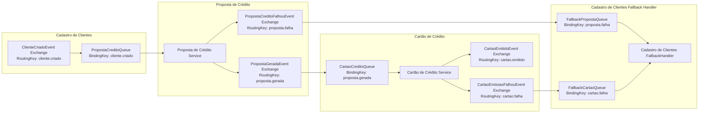
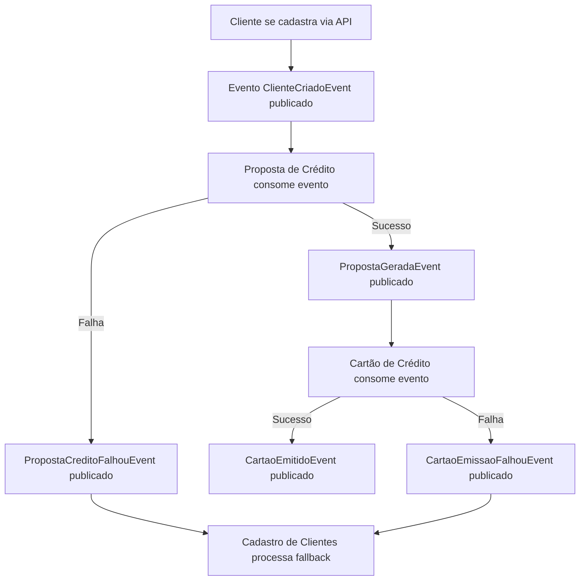

# Paraná Banco Business Case
## 📘 Documentação Técnica

### 🧾 Visão Geral

Este sistema é composto por uma arquitetura distribuída baseada em microsserviços para cadastro de clientes, geração de propostas de crédito e emissão de cartões. Utiliza comunicação assíncrona baseada em eventos, com foco em resiliência, escalabilidade e desacoplamento. Foi desenvolvido como um desafio técnico utilizando princípios de design modernos.

---

### 🎯 Objetivo

Cadastrar um novo cliente por meio de uma API REST e orquestrar os processos de proposta de crédito e emissão de cartões de crédito de forma resiliente.

---

### 📦 Tecnologias Principais

* .NET 8.0
* RabbitMQ
* Docker + Docker Compose
* Arquitetura baseada em Microsserviços
* DDD (Domain-Driven Design)
* Mensageria assíncrona (Pub/Sub)
* Polly para Retry e Resiliência
* Dead Letter Queue (DLQ) como fallback

---

### 🏗️ Arquitetura

A arquitetura segue os seguintes princípios:

* **Microsserviços** independentes e orientados a domínio
* **DDD (Domain-Driven Design)** com separação em camadas (API, Application, Domain, Infra)
* **Mensageria assíncrona** via RabbitMQ (publish/subscribe)
* **Padrões de resiliência**: Retry com backoff e fallback

#### Bounded Contexts

* Cadastro de Clientes
* Proposta de Crédito
* Cartão de Crédito

Cada contexto é implementado como um microsserviço isolado com seus próprios modelos de domínio e contratos de eventos.

---

### 🔧 Microsserviços

| Projeto                  | Responsabilidade                               |
| ------------------------ | ---------------------------------------------- |
| **CadastroClientes.API** | Cadastro de cliente e orquestração via eventos |
| **PropostaCredito.API**  | Geração da proposta de crédito                 |
| **CartaoCredito.API**    | Emissão de um ou mais cartões de crédito       |

---

### 🐳 Executando com Docker Compose

#### ✅ Pré-requisitos

* Docker
* Docker Compose

#### ▶️ Subir o ambiente

```bash
docker-compose up --build
```

#### 🌐 Serviços Disponíveis

| Serviço                | Porta Externa                                    | Descrição                              |
| ---------------------- | ------------------------------------------------ | -------------------------------------- |
| CadastroClientes.API   | [http://localhost:5001](http://localhost:5001)   | POST `/api/clientes`                   |
| PropostaCredito.API    | [http://localhost:5002](http://localhost:5002)   | Escuta eventos e processa propostas    |
| CartaoCredito.API      | [http://localhost:5003](http://localhost:5003)   | Emite cartões de crédito               |
| RabbitMQ Management UI | [http://localhost:15672](http://localhost:15672) | Interface de administração do broker   |
| RabbitMQ Broker        | 5672                                             | Porta AMQP usada entre serviços        |
| PostgreSQL             | 5432                                             | Banco de dados relacional dos serviços |

---

### 🔁 Fluxo de Comunicação entre Microsserviços

1. `CadastroClientes` publica `ClienteCriadoEvent`
2. `PropostaCredito` consome, gera proposta e publica:

   * Sucesso: `PropostaGeradaEvent`
   * Falha: `PropostaCreditoFalhouEvent`
3. `CartaoCredito` consome proposta e tenta emitir cartão:

   * Sucesso: `CartaoEmitidoEvent`
   * Falha: `CartaoEmissaoFalhouEvent`
4. `CadastroClientes` escuta eventos de falha e executa fallback

---

### 📬 Topologia de Mensageria - Exchanges, Filas e Bindings



Para monitoramento em tempo real, recomenda-se o uso do **RabbitMQ Management Plugin** (porta 15672), que permite visualizar:

* Exchanges
* Queues
* Bindings
* Dead-letter queues e mensagens em trânsito

---

### 📡 Testando a API

Exemplo de requisição via `curl` ou Postman:

```http
POST http://localhost:5001/api/clientes
Content-Type: application/json

{
  "nome": "Maria Oliveira",
  "cpf": "12345678901",
  "email": "maria@exemplo.com",
  "telefone": "41999999999",
  "dataNascimento": "1990-01-01",
  "rendaMensal": 5000,
  "valorCreditoDesejado": 10000
}
```

---

### 🧪 Testes

* Testes unitários e de integração podem ser realizados com `xUnit`
* Você pode simular falhas publicando manualmente eventos com payloads inválidos nas filas

---

### 🛡️ Resiliência

* **Retry (Polly):** chamadas com falha transitória são repetidas com políticas de backoff
* **DLQ/Fallback:** eventos com falha são redirecionados para análise futura ou reprocessamento

---

### 📈 Observabilidade

* Logs estruturados com `ILogger`
* Fallbacks registrados nos consumidores de falha
* RabbitMQ acessível via [http://localhost:15672](http://localhost:15672)

---

### 📌 Motivação da Solução

* Desacoplamento entre serviços
* Tolerância a falhas sem afetar o cadastro de clientes
* Consistência eventual como estratégia para ambientes distribuídos
* Observabilidade por meio de logs e eventos de erro
* Escalabilidade horizontal via microsserviços isolados

---

### 📊 Fluxograma de Processo



---

### ✅ Considerações Finais

Esta aplicação demonstra uma arquitetura moderna, resiliente e escalável para processos críticos de negócio que exigem coordenação entre múltiplos microsserviços desacoplados. O uso de padrões como retry e fallback garante robustez mesmo diante de falhas parciais. Adicionalmente, recomenda-se expandir com mecanismos de monitoramento ativo (como métricas e alertas via Prometheus/Grafana ou Application Insights).
